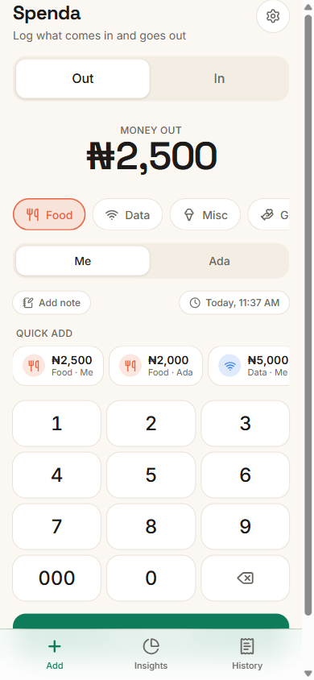
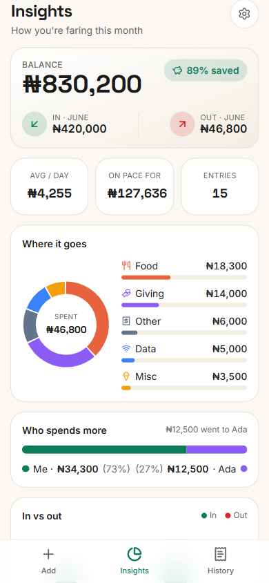
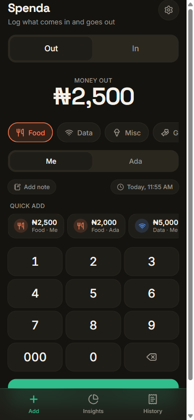

# Spenda

A personal money tracker PWA — built around how *you* actually spend (food twice a
day for you and your babe, data, treats, giving, plus the money coming in from work
and gifts). Naira-first, offline-first, installable on your iPad and Samsung phone.

<p align="center">
  
  
  
</p>

## What it does

- **Add** — a fast, custom keypad. Toggle **Out / In**, pick a category, tag **Me** or
  your babe, and add. Stays on screen for rapid multi-entry. Quick-add tiles repeat your
  most common spends in one tap.
- **Insights** — balance, money in vs out, savings rate, where it goes (donut + bars),
  who spends more (and how much left your hand to your babe), month-over-month trend,
  plain-language recommendations, and a **what-if** simulator (trim a category, see what
  you'd save per month and per year).
- **History** — everything in and out, grouped by day, filterable by type/payer, with
  search and tap-to-edit/delete.
- **Lock** — a 4-digit PIN, stored hashed on the device only (never synced).
- **Sync** — optional Supabase backend keeps your iPad and phone in step.

## Stack

Next.js (App Router, **JavaScript — no TypeScript**) · Tailwind v4 · Framer Motion ·
Recharts · lucide-react · Dexie (IndexedDB, local-first) · Zustand · Supabase ·
date-fns. Fonts: Space Grotesk (display) + Inter (UI).

## Run it

```bash
npm install
npm run dev      # http://localhost:3000
npm run build && npm start   # production (service worker is prod-only)
```

## Sync (optional)

The app is fully usable offline with no backend. To sync across devices, set in
`.env.local` (already wired to your project):

```
NEXT_PUBLIC_SUPABASE_URL=...
NEXT_PUBLIC_SUPABASE_ANON_KEY=...
```

The `transactions` table + Row-Level Security are defined in
[`supabase/schema.sql`](supabase/schema.sql) and already applied. In **Settings → Sync**,
create an account / sign in on each device; data then syncs automatically (local-first,
last-write-wins, soft deletes).

## Install as an app

- **iPad / iPhone (Safari):** Share → Add to Home Screen.
- **Samsung (Chrome):** ⋮ menu → Add to Home screen → Install.

Icons are generated from `scripts/generate-icons.mjs` (`node scripts/generate-icons.mjs`).

## Architecture notes

- `lib/db.js` (Dexie) is the immediate source of truth → optimistic, offline-capable UI.
- `lib/sync.js` mirrors Dexie ↔ Supabase when signed in and online.
- `lib/insights.js` holds all the analytics + recommendation rules (deterministic, offline).
- Amounts are whole naira (no kobo) for fast entry.
